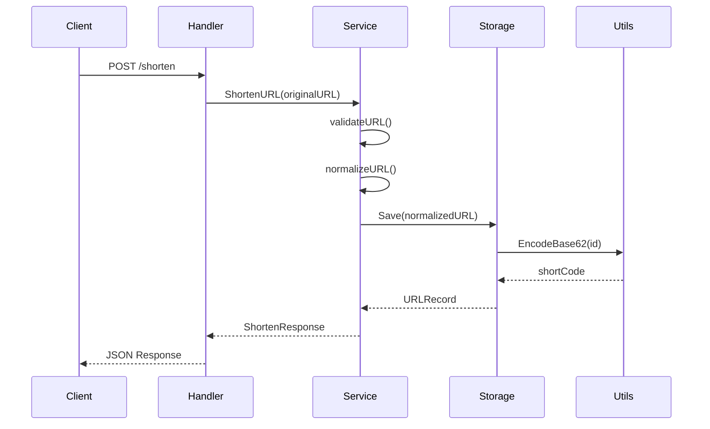
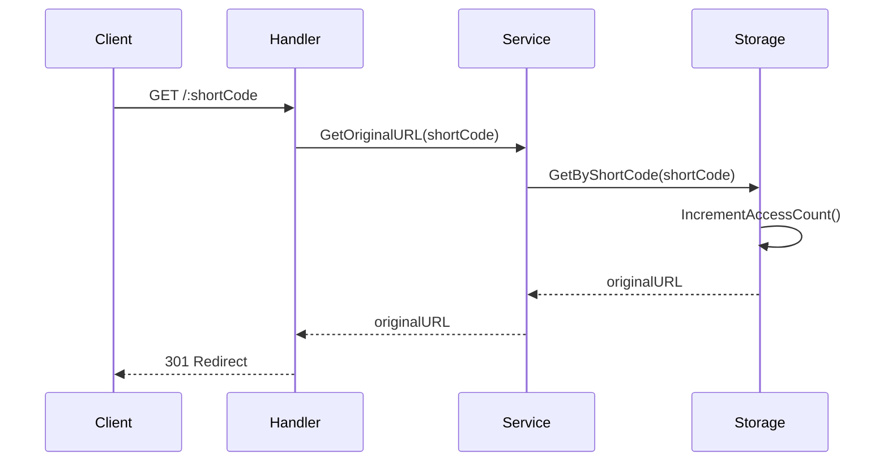

# 第1章：项目概述与架构设计

## 🎯 项目目标

构建一个高性能、可扩展的短链接生成器服务，具备以下核心功能：

1. **短链接生成**：将长 URL 转换为简短的链接
2. **智能重定向**：访问短链接时自动跳转到原始 URL
3. **访问统计**：记录每个短链接的访问次数
4. **链接管理**：查询短链接的详细信息

## 🏗 系统架构设计

### 分层架构

我们采用经典的分层架构模式，确保代码的可维护性和可扩展性：

```
┌─────────────────────────────────────┐
│           HTTP Layer                │
│  ┌─────────────┐ ┌─────────────┐   │
│  │  Handlers   │ │ Middleware  │   │
│  └─────────────┘ └─────────────┘   │
├─────────────────────────────────────┤
│          Service Layer              │
│  ┌─────────────────────────────┐   │
│  │     Business Logic          │   │
│  │  - URL Validation           │   │
│  │  - Short Code Generation    │   │
│  │  - Access Count Management  │   │
│  └─────────────────────────────┘   │
├─────────────────────────────────────┤
│          Storage Layer              │
│  ┌─────────────────────────────┐   │
│  │     Data Access             │   │
│  │  - Memory Storage           │   │
│  │  - CRUD Operations          │   │
│  │  - Concurrent Safety        │   │
│  └─────────────────────────────┘   │
├─────────────────────────────────────┤
│           Utils Layer               │
│  ┌─────────────────────────────┐   │
│  │     Utility Functions       │   │
│  │  - Base62 Encoding          │   │
│  │  - Configuration            │   │
│  └─────────────────────────────┘   │
└─────────────────────────────────────┘
```

### 核心组件说明

#### 1. HTTP Layer（HTTP 层）
- **职责**：处理 HTTP 请求和响应
- **组件**：
  - `handlers/`：HTTP 请求处理器
  - 中间件：CORS、日志、错误处理

#### 2. Service Layer（服务层）
- **职责**：业务逻辑处理
- **组件**：
  - URL 验证和标准化
  - 短码生成算法
  - 访问计数管理

#### 3. Storage Layer（存储层）
- **职责**：数据持久化和访问
- **组件**：
  - 内存存储实现
  - 并发安全机制
  - 数据模型定义

#### 4. Utils Layer（工具层）
- **职责**：通用工具和配置
- **组件**：
  - Base62 编码/解码
  - 配置管理
  - 常用工具函数

## 🔧 技术选型

### 核心技术栈

| 技术 | 版本 | 用途 | 选择理由 |
|------|------|------|----------|
| **Go** | 1.21+ | 主要编程语言 | 高性能、并发友好、简洁语法 |
| **Gin** | v1.9.1 | Web 框架 | 轻量级、高性能、丰富的中间件 |
| **Base62** | 自实现 | 编码算法 | URL 友好、短码简洁 |

### 开发工具

| 工具 | 用途 |
|------|------|
| **Go Modules** | 依赖管理 |
| **Testify** | 测试框架 |
| **Docker** | 容器化 |
| **Makefile** | 构建自动化 |

## 📊 数据流设计

### 短链接生成流程



### 短链接访问流程



## 🎨 设计原则

### 1. 单一职责原则 (SRP)
每个组件只负责一个特定的功能：
- Handler 只处理 HTTP 请求
- Service 只处理业务逻辑
- Storage 只处理数据存储

### 2. 开闭原则 (OCP)
系统对扩展开放，对修改关闭：
- 存储层可以轻松替换为数据库实现
- 可以添加新的编码算法
- 可以扩展新的 API 端点

### 3. 依赖倒置原则 (DIP)
高层模块不依赖低层模块：
- Service 层通过接口使用 Storage
- Handler 层通过接口使用 Service

### 4. 接口隔离原则 (ISP)
客户端不应该依赖它不需要的接口：
- 每个接口都很小且专注
- 避免臃肿的接口设计

## 🚀 性能考虑

### 1. 内存存储
- **优势**：毫秒级响应时间
- **劣势**：数据不持久化
- **适用场景**：原型开发、高性能要求

### 2. 并发安全
- 使用读写锁 (`sync.RWMutex`)
- 支持高并发读操作
- 写操作互斥保护

### 3. 算法优化
- Base62 编码：O(log n) 时间复杂度
- 哈希表查找：O(1) 平均时间复杂度

## 📈 可扩展性设计

### 1. 水平扩展
- 无状态服务设计
- 支持负载均衡
- 可部署多个实例

### 2. 存储扩展
- 抽象存储接口
- 可替换为 Redis、MySQL 等
- 支持分布式存储

### 3. 功能扩展
- 模块化设计
- 插件化架构
- API 版本控制

## 🔍 监控与观测

### 1. 健康检查
- `/health` 端点
- 服务状态监控
- 依赖检查

### 2. 性能指标
- 响应时间监控
- 吞吐量统计
- 错误率追踪

### 3. 日志记录
- 结构化日志
- 请求追踪
- 错误日志

## 📝 小结

本章介绍了项目的整体架构设计和技术选型。关键要点：

1. **分层架构**：清晰的职责分离
2. **技术选型**：Go + Gin 的高性能组合
3. **设计原则**：遵循 SOLID 原则
4. **性能优化**：内存存储 + 并发安全
5. **可扩展性**：模块化设计支持未来扩展

下一章我们将开始项目的初始化和依赖管理。
