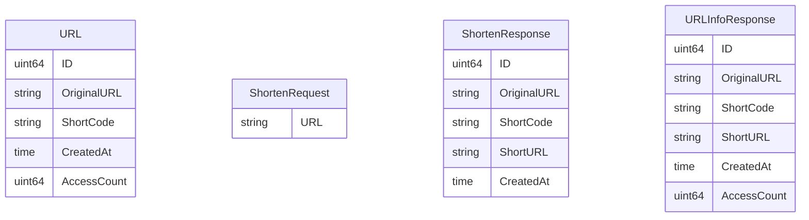

# 第4章：数据模型设计

## 🎯 本章目标

设计和实现系统的核心数据模型：
- 定义 URL 实体结构
- 设计请求和响应模型
- 实现数据验证
- 错误处理模型

## 📊 数据模型概述

### 核心实体关系



### 模型分类

| 模型类型 | 用途 | 示例 |
|----------|------|------|
| **实体模型** | 核心业务对象 | `URL` |
| **请求模型** | API 输入验证 | `ShortenRequest` |
| **响应模型** | API 输出格式 | `ShortenResponse` |
| **错误模型** | 错误信息标准化 | `ErrorResponse` |

## 🏗 实现核心实体模型

### 创建 models/url.go

```go
package models

import (
    "time"
)

// URL 表示一个短链接记录
type URL struct {
    ID          uint64    `json:"id"`          // 唯一标识符
    OriginalURL string    `json:"original_url"` // 原始长 URL
    ShortCode   string    `json:"short_code"`   // 短链接代码
    CreatedAt   time.Time `json:"created_at"`   // 创建时间
    AccessCount uint64    `json:"access_count"` // 访问次数
}
```

### 字段设计说明

| 字段 | 类型 | 说明 | 设计考虑 |
|------|------|------|----------|
| `ID` | `uint64` | 主键，用于生成短码 | 支持大量 URL，自增唯一 |
| `OriginalURL` | `string` | 原始 URL | 支持长 URL，无长度限制 |
| `ShortCode` | `string` | Base62 编码的短码 | URL 友好，简洁易记 |
| `CreatedAt` | `time.Time` | 创建时间戳 | 支持时区，便于统计分析 |
| `AccessCount` | `uint64` | 访问计数 | 支持高频访问统计 |

### JSON 标签说明

```go
type URL struct {
    ID          uint64    `json:"id"`
    //                    ↑
    //                    JSON 序列化时的字段名
    OriginalURL string    `json:"original_url"`
    //                    ↑
    //                    使用下划线命名风格
}
```

## 📥 请求模型设计

### 短链接创建请求

```go
// ShortenRequest 表示创建短链接的请求
type ShortenRequest struct {
    URL string `json:"url" binding:"required,url"` // 原始 URL，必填且必须是有效 URL
}
```

### Gin 验证标签详解

| 标签 | 说明 | 示例 |
|------|------|------|
| `required` | 必填字段 | `binding:"required"` |
| `url` | URL 格式验证 | `binding:"url"` |
| `min` | 最小长度 | `binding:"min=1"` |
| `max` | 最大长度 | `binding:"max=2048"` |
| `email` | 邮箱格式 | `binding:"email"` |

### 扩展验证示例

```go
// 更复杂的验证规则
type ShortenRequestAdvanced struct {
    URL         string `json:"url" binding:"required,url,max=2048"`
    CustomCode  string `json:"custom_code,omitempty" binding:"omitempty,alphanum,min=3,max=10"`
    ExpiresAt   *time.Time `json:"expires_at,omitempty"`
    Description string `json:"description,omitempty" binding:"max=255"`
}
```

## 📤 响应模型设计

### 短链接创建响应

```go
// ShortenResponse 表示创建短链接的响应
type ShortenResponse struct {
    ID          uint64    `json:"id"`
    OriginalURL string    `json:"original_url"`
    ShortCode   string    `json:"short_code"`
    ShortURL    string    `json:"short_url"`    // 完整的短链接 URL
    CreatedAt   time.Time `json:"created_at"`
}
```

### URL 信息查询响应

```go
// URLInfoResponse 表示查询短链接信息的响应
type URLInfoResponse struct {
    ID          uint64    `json:"id"`
    OriginalURL string    `json:"original_url"`
    ShortCode   string    `json:"short_code"`
    ShortURL    string    `json:"short_url"`
    CreatedAt   time.Time `json:"created_at"`
    AccessCount uint64    `json:"access_count"`
}
```

### 响应模型设计原则

1. **一致性**：所有响应都包含相同的基础字段
2. **完整性**：提供客户端需要的所有信息
3. **扩展性**：便于未来添加新字段
4. **性能**：避免不必要的字段

## ❌ 错误模型设计

### 标准错误响应

```go
// ErrorResponse 表示错误响应
type ErrorResponse struct {
    Error   string `json:"error"`
    Message string `json:"message,omitempty"`
}
```

### 错误类型定义

```go
// 预定义错误类型
const (
    ErrInvalidRequest   = "invalid_request"
    ErrInvalidURL      = "invalid_url"
    ErrInvalidShortCode = "invalid_short_code"
    ErrURLNotFound     = "url_not_found"
    ErrInternalError   = "internal_error"
)
```

### 错误响应构造函数

```go
// NewErrorResponse 创建标准错误响应
func NewErrorResponse(errorCode, message string) ErrorResponse {
    return ErrorResponse{
        Error:   errorCode,
        Message: message,
    }
}

// 便捷的错误响应创建函数
func NewInvalidURLError(message string) ErrorResponse {
    return NewErrorResponse(ErrInvalidURL, message)
}

func NewNotFoundError(message string) ErrorResponse {
    return NewErrorResponse(ErrURLNotFound, message)
}
```

## 🔧 模型方法实现

### URL 实体方法

```go
// IsExpired 检查 URL 是否过期（如果有过期时间）
func (u *URL) IsExpired() bool {
    // 当前版本不支持过期，始终返回 false
    return false
}

// IncrementAccess 增加访问计数（线程不安全，需要在存储层处理）
func (u *URL) IncrementAccess() {
    u.AccessCount++
}

// GetAge 获取 URL 的存在时长
func (u *URL) GetAge() time.Duration {
    return time.Since(u.CreatedAt)
}
```

### 请求验证方法

```go
// Validate 自定义验证逻辑
func (r *ShortenRequest) Validate() error {
    if strings.TrimSpace(r.URL) == "" {
        return errors.New("URL cannot be empty")
    }
    
    if len(r.URL) > 2048 {
        return errors.New("URL too long")
    }
    
    // 检查是否为本服务的短链接（避免循环）
    if strings.Contains(r.URL, "localhost:8080") {
        return errors.New("cannot shorten our own short URLs")
    }
    
    return nil
}
```

## 🧪 模型测试

### 创建 models/url_test.go

```go
package models

import (
    "encoding/json"
    "testing"
    "time"

    "github.com/stretchr/testify/assert"
)

func TestURL_JSONSerialization(t *testing.T) {
    url := URL{
        ID:          1,
        OriginalURL: "https://www.example.com",
        ShortCode:   "abc123",
        CreatedAt:   time.Now(),
        AccessCount: 5,
    }

    // 序列化
    jsonData, err := json.Marshal(url)
    assert.NoError(t, err)

    // 反序列化
    var decoded URL
    err = json.Unmarshal(jsonData, &decoded)
    assert.NoError(t, err)

    assert.Equal(t, url.ID, decoded.ID)
    assert.Equal(t, url.OriginalURL, decoded.OriginalURL)
    assert.Equal(t, url.ShortCode, decoded.ShortCode)
    assert.Equal(t, url.AccessCount, decoded.AccessCount)
}

func TestURL_Methods(t *testing.T) {
    url := URL{
        ID:          1,
        OriginalURL: "https://www.example.com",
        ShortCode:   "abc123",
        CreatedAt:   time.Now().Add(-time.Hour),
        AccessCount: 0,
    }

    // 测试 GetAge
    age := url.GetAge()
    assert.True(t, age > 50*time.Minute)
    assert.True(t, age < 70*time.Minute)

    // 测试 IncrementAccess
    url.IncrementAccess()
    assert.Equal(t, uint64(1), url.AccessCount)

    // 测试 IsExpired
    assert.False(t, url.IsExpired())
}
```

### 请求验证测试

```go
func TestShortenRequest_Validate(t *testing.T) {
    tests := []struct {
        name    string
        request ShortenRequest
        wantErr bool
    }{
        {
            name:    "Valid URL",
            request: ShortenRequest{URL: "https://www.example.com"},
            wantErr: false,
        },
        {
            name:    "Empty URL",
            request: ShortenRequest{URL: ""},
            wantErr: true,
        },
        {
            name:    "Whitespace URL",
            request: ShortenRequest{URL: "   "},
            wantErr: true,
        },
        {
            name:    "Self-referencing URL",
            request: ShortenRequest{URL: "http://localhost:8080/abc123"},
            wantErr: true,
        },
    }

    for _, tt := range tests {
        t.Run(tt.name, func(t *testing.T) {
            err := tt.request.Validate()
            if tt.wantErr {
                assert.Error(t, err)
            } else {
                assert.NoError(t, err)
            }
        })
    }
}
```

## 📋 模型文档生成

### 使用结构体标签生成文档

```go
// URL 短链接实体
// @Description 短链接的完整信息
type URL struct {
    // 唯一标识符
    // @Description 数据库主键，用于生成短码
    // @Example 1
    ID uint64 `json:"id" example:"1"`
    
    // 原始 URL
    // @Description 用户提交的完整 URL
    // @Example https://www.example.com/very/long/path
    OriginalURL string `json:"original_url" example:"https://www.example.com"`
    
    // 短链接代码
    // @Description Base62 编码的短码
    // @Example abc123
    ShortCode string `json:"short_code" example:"abc123"`
    
    // 创建时间
    // @Description ISO 8601 格式的时间戳
    CreatedAt time.Time `json:"created_at"`
    
    // 访问次数
    // @Description 通过短链接访问的总次数
    // @Example 42
    AccessCount uint64 `json:"access_count" example:"42"`
}
```

## 🔄 模型转换

### 实体到响应的转换

```go
// ToShortenResponse 将 URL 实体转换为创建响应
func (u *URL) ToShortenResponse(baseURL string) ShortenResponse {
    return ShortenResponse{
        ID:          u.ID,
        OriginalURL: u.OriginalURL,
        ShortCode:   u.ShortCode,
        ShortURL:    fmt.Sprintf("%s/%s", strings.TrimRight(baseURL, "/"), u.ShortCode),
        CreatedAt:   u.CreatedAt,
    }
}

// ToInfoResponse 将 URL 实体转换为信息响应
func (u *URL) ToInfoResponse(baseURL string) URLInfoResponse {
    return URLInfoResponse{
        ID:          u.ID,
        OriginalURL: u.OriginalURL,
        ShortCode:   u.ShortCode,
        ShortURL:    fmt.Sprintf("%s/%s", strings.TrimRight(baseURL, "/"), u.ShortCode),
        CreatedAt:   u.CreatedAt,
        AccessCount: u.AccessCount,
    }
}
```

## 📊 模型统计

### 添加统计方法

```go
// URLStats 统计信息
type URLStats struct {
    TotalURLs     int64     `json:"total_urls"`
    TotalAccesses int64     `json:"total_accesses"`
    CreatedToday  int64     `json:"created_today"`
    LastCreated   time.Time `json:"last_created"`
}

// CalculateStats 计算统计信息（在存储层实现）
func CalculateStats(urls []*URL) URLStats {
    stats := URLStats{}
    today := time.Now().Truncate(24 * time.Hour)
    
    for _, url := range urls {
        stats.TotalURLs++
        stats.TotalAccesses += int64(url.AccessCount)
        
        if url.CreatedAt.After(today) {
            stats.CreatedToday++
        }
        
        if url.CreatedAt.After(stats.LastCreated) {
            stats.LastCreated = url.CreatedAt
        }
    }
    
    return stats
}
```

## 📝 小结

本章我们设计了完整的数据模型系统：

1. **核心实体**：URL 结构体包含所有必要字段
2. **请求模型**：带验证的输入结构
3. **响应模型**：标准化的输出格式
4. **错误模型**：统一的错误处理
5. **模型方法**：实用的业务方法
6. **测试覆盖**：确保模型正确性

关键要点：
- 使用 JSON 标签控制序列化
- Gin 验证标签简化输入验证
- 模型方法封装业务逻辑
- 转换函数分离关注点
- 完整测试确保可靠性

下一章我们将实现配置管理系统，支持环境变量和配置文件。
