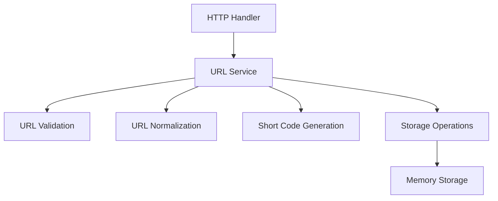

# 第7章：业务逻辑服务层

## 🎯 本章目标

实现核心业务逻辑服务层：
- URL 验证和标准化
- 短链接生成逻辑
- 业务规则封装
- 错误处理机制

## 🏗 服务层架构

### 服务层职责



### 设计原则

1. **单一职责**：每个服务专注特定业务领域
2. **依赖注入**：通过接口依赖存储层
3. **错误封装**：将存储错误转换为业务错误
4. **业务规则**：集中管理所有业务逻辑

## 💼 URL 服务实现

### 创建 services/url_service.go

```go
package services

import (
    "errors"
    "net/url"
    "strings"

    "gin-url-shortener/config"
    "gin-url-shortener/models"
    "gin-url-shortener/storage"
    "gin-url-shortener/utils"
)

var (
    ErrInvalidURL       = errors.New("invalid URL format")
    ErrURLNotFound      = errors.New("short URL not found")
    ErrInvalidShortCode = errors.New("invalid short code format")
)

// URLService URL 业务逻辑服务
type URLService struct {
    storage storage.URLStorage // 使用接口，支持依赖注入
    config  *config.Config
}

// NewURLService 创建新的 URL 服务实例
func NewURLService(storage storage.URLStorage, config *config.Config) *URLService {
    return &URLService{
        storage: storage,
        config:  config,
    }
}
```

### 接口设计

```go
// URLServiceInterface 定义服务接口
type URLServiceInterface interface {
    ShortenURL(originalURL string) (*models.ShortenResponse, error)
    GetOriginalURL(shortCode string) (string, error)
    GetURLInfo(shortCode string) (*models.URLInfoResponse, error)
    GetStats() (map[string]interface{}, error)
}
```

## 🔍 URL 验证与标准化

### URL 验证逻辑

```go
// validateURL 验证 URL 格式
func (s *URLService) validateURL(rawURL string) error {
    if strings.TrimSpace(rawURL) == "" {
        return ErrInvalidURL
    }

    // 检查 URL 长度
    if len(rawURL) > s.config.MaxURLLength {
        return errors.New("URL too long")
    }

    // 尝试解析 URL
    parsedURL, err := url.Parse(rawURL)
    if err != nil {
        return ErrInvalidURL
    }

    // 检查是否有有效的 scheme 和 host
    if parsedURL.Scheme == "" || parsedURL.Host == "" {
        // 尝试添加 http:// 前缀后再次解析
        if parsedURL, err = url.Parse("http://" + rawURL); err != nil {
            return ErrInvalidURL
        }
        if parsedURL.Host == "" {
            return ErrInvalidURL
        }
    }

    // 检查 scheme 是否为 http 或 https
    if parsedURL.Scheme != "http" && parsedURL.Scheme != "https" {
        return ErrInvalidURL
    }

    // 额外验证：检查主机名格式
    if !s.isValidHost(parsedURL.Host) {
        return ErrInvalidURL
    }

    // 防止循环引用：不能缩短自己的短链接
    if s.isSelfReference(parsedURL) {
        return errors.New("cannot shorten our own short URLs")
    }

    return nil
}
```

### 主机名验证

```go
// isValidHost 验证主机名是否有效
func (s *URLService) isValidHost(host string) bool {
    // 允许 localhost
    if host == "localhost" {
        return true
    }

    // 检查是否包含点号（基本的域名格式检查）
    if !strings.Contains(host, ".") {
        return false
    }

    // 检查是否为 IP 地址
    if net.ParseIP(host) != nil {
        return true
    }

    // 基本域名格式检查
    parts := strings.Split(host, ".")
    if len(parts) < 2 {
        return false
    }

    for _, part := range parts {
        if len(part) == 0 {
            return false
        }
    }

    return true
}
```

### 自引用检查

```go
// isSelfReference 检查是否为自引用
func (s *URLService) isSelfReference(parsedURL *url.URL) bool {
    baseURL, err := url.Parse(s.config.BaseURL)
    if err != nil {
        return false
    }

    return parsedURL.Host == baseURL.Host
}
```

### URL 标准化

```go
// normalizeURL 标准化 URL
func (s *URLService) normalizeURL(rawURL string) string {
    parsedURL, err := url.Parse(rawURL)
    if err != nil {
        // 如果解析失败，尝试添加 http:// 前缀
        if parsedURL, err = url.Parse("http://" + rawURL); err != nil {
            return rawURL // 返回原始 URL
        }
    }

    // 如果没有 scheme，添加 http://
    if parsedURL.Scheme == "" {
        parsedURL.Scheme = "http"
    }

    // 标准化主机名（转为小写）
    parsedURL.Host = strings.ToLower(parsedURL.Host)

    // 移除默认端口
    if (parsedURL.Scheme == "http" && strings.HasSuffix(parsedURL.Host, ":80")) ||
       (parsedURL.Scheme == "https" && strings.HasSuffix(parsedURL.Host, ":443")) {
        parsedURL.Host = strings.Split(parsedURL.Host, ":")[0]
    }

    // 标准化路径
    if parsedURL.Path == "" {
        parsedURL.Path = "/"
    }

    return parsedURL.String()
}
```

## 🔗 短链接生成服务

### 核心生成逻辑

```go
// ShortenURL 创建短链接
func (s *URLService) ShortenURL(originalURL string) (*models.ShortenResponse, error) {
    // 1. 验证 URL 格式
    if err := s.validateURL(originalURL); err != nil {
        return nil, err
    }

    // 2. 标准化 URL
    normalizedURL := s.normalizeURL(originalURL)

    // 3. 保存到存储
    urlRecord, err := s.storage.Save(normalizedURL)
    if err != nil {
        return nil, s.wrapStorageError(err)
    }

    // 4. 构建响应
    response := &models.ShortenResponse{
        ID:          urlRecord.ID,
        OriginalURL: urlRecord.OriginalURL,
        ShortCode:   urlRecord.ShortCode,
        ShortURL:    s.buildShortURL(urlRecord.ShortCode),
        CreatedAt:   urlRecord.CreatedAt,
    }

    return response, nil
}
```

### 短链接访问服务

```go
// GetOriginalURL 根据短码获取原始 URL 并增加访问计数
func (s *URLService) GetOriginalURL(shortCode string) (string, error) {
    // 1. 验证短码格式
    if !utils.IsValidBase62(shortCode) {
        return "", ErrInvalidShortCode
    }

    // 2. 获取 URL 记录
    urlRecord, err := s.storage.GetByShortCode(shortCode)
    if err != nil {
        return "", s.wrapStorageError(err)
    }

    // 3. 增加访问计数（异步处理，不影响重定向性能）
    go func() {
        if err := s.storage.IncrementAccessCount(shortCode); err != nil {
            // 记录错误但不影响重定向
            // 在实际应用中可以使用日志记录
        }
    }()

    return urlRecord.OriginalURL, nil
}
```

### URL 信息查询服务

```go
// GetURLInfo 获取短链接详细信息
func (s *URLService) GetURLInfo(shortCode string) (*models.URLInfoResponse, error) {
    // 1. 验证短码格式
    if !utils.IsValidBase62(shortCode) {
        return nil, ErrInvalidShortCode
    }

    // 2. 获取 URL 记录
    urlRecord, err := s.storage.GetByShortCode(shortCode)
    if err != nil {
        return nil, s.wrapStorageError(err)
    }

    // 3. 构建响应
    response := &models.URLInfoResponse{
        ID:          urlRecord.ID,
        OriginalURL: urlRecord.OriginalURL,
        ShortCode:   urlRecord.ShortCode,
        ShortURL:    s.buildShortURL(urlRecord.ShortCode),
        CreatedAt:   urlRecord.CreatedAt,
        AccessCount: urlRecord.AccessCount,
    }

    return response, nil
}
```

## 🛠 工具方法

### URL 构建

```go
// buildShortURL 构建完整的短链接 URL
func (s *URLService) buildShortURL(shortCode string) string {
    baseURL := strings.TrimRight(s.config.BaseURL, "/")
    return baseURL + "/" + shortCode
}
```

### 错误处理

```go
// wrapStorageError 包装存储层错误为业务错误
func (s *URLService) wrapStorageError(err error) error {
    switch err {
    case storage.ErrURLNotFound:
        return ErrURLNotFound
    default:
        return err
    }
}
```

### 统计服务

```go
// GetStats 获取服务统计信息
func (s *URLService) GetStats() (map[string]interface{}, error) {
    storageStats := s.storage.GetStats()
    
    // 添加业务层统计
    stats := make(map[string]interface{})
    for k, v := range storageStats {
        stats[k] = v
    }
    
    // 添加配置信息
    stats["max_url_length"] = s.config.MaxURLLength
    stats["base_url"] = s.config.BaseURL
    
    return stats, nil
}
```

## 🧪 服务层测试

### 创建 services/url_service_test.go

```go
package services

import (
    "testing"

    "github.com/stretchr/testify/assert"
    "github.com/stretchr/testify/require"

    "gin-url-shortener/config"
    "gin-url-shortener/storage"
)

func TestURLService_ShortenURL(t *testing.T) {
    // 设置测试环境
    memStorage := storage.NewMemoryStorage()
    cfg := &config.Config{
        BaseURL:      "http://localhost:8080",
        MaxURLLength: 2048,
    }
    service := NewURLService(memStorage, cfg)

    t.Run("Valid URL", func(t *testing.T) {
        originalURL := "https://www.example.com"
        
        response, err := service.ShortenURL(originalURL)
        
        require.NoError(t, err)
        assert.NotEmpty(t, response.ShortCode)
        assert.Equal(t, originalURL, response.OriginalURL)
        assert.Equal(t, "http://localhost:8080/"+response.ShortCode, response.ShortURL)
        assert.NotZero(t, response.ID)
        assert.NotZero(t, response.CreatedAt)
    })

    t.Run("URL without protocol", func(t *testing.T) {
        originalURL := "www.example.com"
        expectedURL := "http://www.example.com"
        
        response, err := service.ShortenURL(originalURL)
        
        require.NoError(t, err)
        assert.Equal(t, expectedURL, response.OriginalURL)
    })

    t.Run("Invalid URL", func(t *testing.T) {
        invalidURLs := []string{
            "",
            "   ",
            "not-a-url",
            "ftp://example.com", // 不支持的协议
        }
        
        for _, invalidURL := range invalidURLs {
            _, err := service.ShortenURL(invalidURL)
            assert.Error(t, err, "Should return error for invalid URL: %s", invalidURL)
        }
    })
}
```

### 并发测试

```go
func TestURLService_Concurrent(t *testing.T) {
    memStorage := storage.NewMemoryStorage()
    cfg := &config.Config{
        BaseURL:      "http://localhost:8080",
        MaxURLLength: 2048,
    }
    service := NewURLService(memStorage, cfg)

    const numGoroutines = 50
    const urlsPerGoroutine = 20

    var wg sync.WaitGroup
    wg.Add(numGoroutines)

    for i := 0; i < numGoroutines; i++ {
        go func(goroutineID int) {
            defer wg.Done()
            
            for j := 0; j < urlsPerGoroutine; j++ {
                url := fmt.Sprintf("https://example%d-%d.com", goroutineID, j)
                _, err := service.ShortenURL(url)
                assert.NoError(t, err)
            }
        }(i)
    }

    wg.Wait()

    stats, err := service.GetStats()
    require.NoError(t, err)
    assert.Equal(t, numGoroutines*urlsPerGoroutine, stats["total_urls"])
}
```

## 🔧 高级功能

### 批量处理

```go
// ShortenURLBatch 批量创建短链接
func (s *URLService) ShortenURLBatch(originalURLs []string) ([]*models.ShortenResponse, error) {
    responses := make([]*models.ShortenResponse, 0, len(originalURLs))
    
    for _, originalURL := range originalURLs {
        response, err := s.ShortenURL(originalURL)
        if err != nil {
            // 记录错误但继续处理其他 URL
            continue
        }
        responses = append(responses, response)
    }
    
    return responses, nil
}
```

### 缓存支持

```go
import (
    "sync"
    "time"
)

// URLCache 简单的内存缓存
type URLCache struct {
    cache map[string]*models.URL
    mutex sync.RWMutex
    ttl   time.Duration
}

// NewURLCache 创建缓存
func NewURLCache(ttl time.Duration) *URLCache {
    return &URLCache{
        cache: make(map[string]*models.URL),
        ttl:   ttl,
    }
}

// Get 从缓存获取
func (c *URLCache) Get(shortCode string) (*models.URL, bool) {
    c.mutex.RLock()
    defer c.mutex.RUnlock()
    
    url, exists := c.cache[shortCode]
    return url, exists
}

// Set 设置缓存
func (c *URLCache) Set(shortCode string, url *models.URL) {
    c.mutex.Lock()
    defer c.mutex.Unlock()
    
    c.cache[shortCode] = url
    
    // 简单的 TTL 实现
    go func() {
        time.Sleep(c.ttl)
        c.mutex.Lock()
        delete(c.cache, shortCode)
        c.mutex.Unlock()
    }()
}
```

## 📊 性能监控

### 服务指标

```go
import (
    "sync/atomic"
    "time"
)

// ServiceMetrics 服务指标
type ServiceMetrics struct {
    TotalRequests    int64
    SuccessfulShorts int64
    FailedShorts     int64
    TotalRedirects   int64
    AverageLatency   time.Duration
}

// 在服务中添加指标收集
func (s *URLService) recordMetrics(operation string, duration time.Duration, success bool) {
    atomic.AddInt64(&s.metrics.TotalRequests, 1)
    
    if success {
        switch operation {
        case "shorten":
            atomic.AddInt64(&s.metrics.SuccessfulShorts, 1)
        case "redirect":
            atomic.AddInt64(&s.metrics.TotalRedirects, 1)
        }
    } else {
        if operation == "shorten" {
            atomic.AddInt64(&s.metrics.FailedShorts, 1)
        }
    }
}
```

## 📝 小结

本章我们实现了完整的业务逻辑服务层：

1. **URL 验证**：全面的 URL 格式和安全检查
2. **标准化处理**：统一 URL 格式，提高去重效果
3. **业务封装**：将复杂的业务逻辑封装在服务层
4. **错误处理**：统一的错误类型和处理机制
5. **性能优化**：异步访问计数，缓存支持

关键要点：
- 服务层专注业务逻辑，不涉及具体存储实现
- 完整的 URL 验证确保数据质量
- 错误封装提供清晰的错误信息
- 并发安全的设计支持高并发访问

下一章我们将实现 HTTP 处理器，连接 Web 层和业务层。
