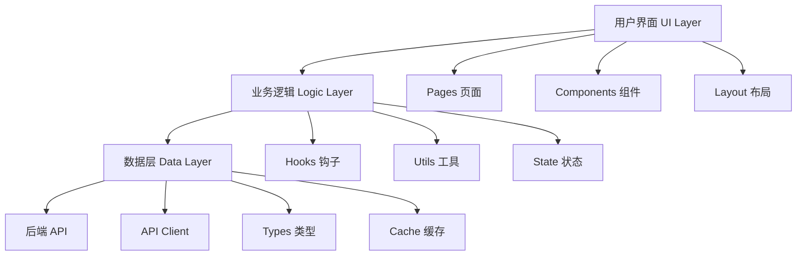
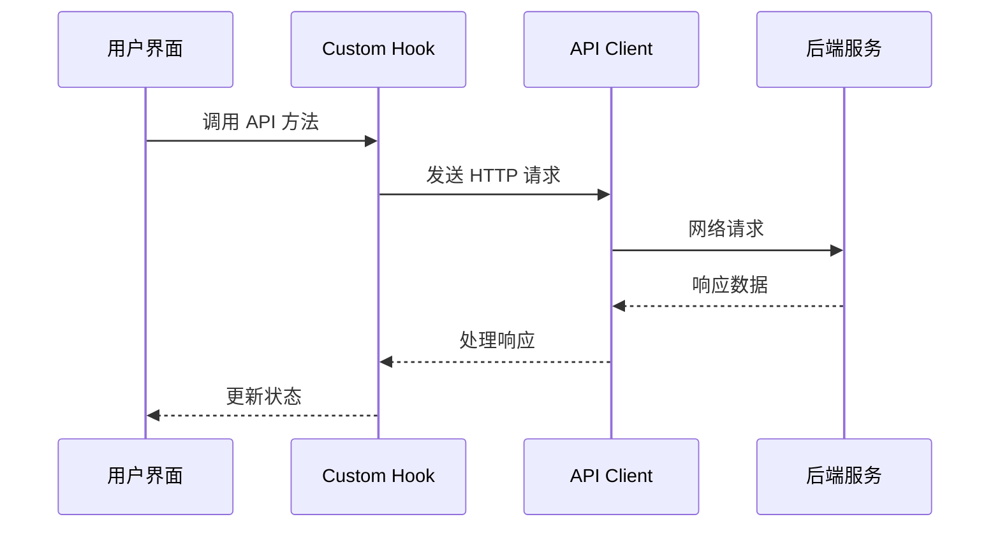

# 第1章：项目概述与技术选型

## 🎯 项目目标

构建一个现代化、高性能的短链接生成器前端应用，具备以下核心功能：

### 核心功能需求
1. **URL 缩短**：将长链接转换为短链接
2. **链接管理**：查看、搜索、排序已创建的链接
3. **数据统计**：展示访问量、创建趋势等分析数据
4. **用户体验**：响应式设计、实时反馈、错误处理

### 技术需求
1. **现代化技术栈**：使用最新的前端技术
2. **类型安全**：TypeScript 提供编译时类型检查
3. **组件化开发**：可复用的 UI 组件库
4. **性能优化**：快速加载和流畅交互

## 🏗 技术架构设计

### 整体架构



### 分层设计原则

#### 1. 表现层 (Presentation Layer)
- **职责**：用户界面展示和交互
- **组件**：
  - Pages：页面级组件
  - Components：功能组件
  - Layout：布局组件
  - UI：基础 UI 组件

#### 2. 逻辑层 (Logic Layer)
- **职责**：业务逻辑处理和状态管理
- **组件**：
  - Custom Hooks：封装业务逻辑
  - Utils：工具函数
  - State Management：状态管理

#### 3. 数据层 (Data Layer)
- **职责**：数据获取、缓存和类型定义
- **组件**：
  - API Client：HTTP 请求封装
  - Types：TypeScript 类型定义
  - Cache：数据缓存策略

## 🛠 技术选型分析

### 核心框架选择

#### Next.js 14
**选择理由**：
- **全栈框架**：支持 SSR、SSG、API Routes
- **性能优化**：自动代码分割、图片优化
- **开发体验**：热重载、TypeScript 支持
- **生产就绪**：内置性能监控、部署优化

**关键特性**：
```javascript
// App Router (Next.js 13+)
app/
├── layout.tsx      // 根布局
├── page.tsx        // 首页
├── manage/
│   └── page.tsx    // 管理页面
└── analytics/
    └── page.tsx    // 统计页面
```

#### TypeScript 5
**选择理由**：
- **类型安全**：编译时错误检测
- **开发效率**：智能提示和重构
- **代码质量**：强制类型约束
- **团队协作**：统一的接口定义

**类型系统设计**：
```typescript
// API 响应类型
interface ShortenResponse {
  id: number;
  original_url: string;
  short_code: string;
  short_url: string;
  created_at: string;
}

// 组件 Props 类型
interface URLShortenerProps {
  onURLCreated?: (url: ShortenResponse) => void;
  className?: string;
}
```

#### Tailwind CSS 3
**选择理由**：
- **实用优先**：原子化 CSS 类
- **响应式设计**：内置断点系统
- **定制化**：灵活的配置系统
- **性能优化**：JIT 编译，按需生成

**设计系统**：
```javascript
// tailwind.config.js
module.exports = {
  theme: {
    extend: {
      colors: {
        primary: {
          50: '#eff6ff',
          500: '#3b82f6',
          600: '#2563eb',
        }
      }
    }
  }
}
```

### 辅助库选择

#### 状态管理
**选择**：React Hooks + Context API
- **轻量级**：无需额外依赖
- **简单易用**：学习成本低
- **类型友好**：TypeScript 支持好

#### HTTP 客户端
**选择**：Axios
- **功能丰富**：拦截器、错误处理
- **浏览器兼容**：广泛的浏览器支持
- **TypeScript 支持**：完整的类型定义

#### 图表库
**选择**：Chart.js + react-chartjs-2
- **功能强大**：多种图表类型
- **响应式**：自适应容器大小
- **可定制**：丰富的配置选项

#### 图标库
**选择**：Lucide React
- **现代设计**：简洁的线性图标
- **Tree Shaking**：按需导入
- **一致性**：统一的设计风格

## 📁 项目结构设计

### 目录结构

```
frontend/
├── src/
│   ├── components/          # 组件目录
│   │   ├── ui/             # 基础 UI 组件
│   │   │   ├── Button.tsx
│   │   │   ├── Input.tsx
│   │   │   └── Card.tsx
│   │   ├── URLShortener.tsx # 功能组件
│   │   ├── URLList.tsx
│   │   └── Layout.tsx
│   ├── pages/              # 页面组件
│   │   ├── _app.tsx        # 应用入口
│   │   ├── index.tsx       # 首页
│   │   ├── manage.tsx      # 管理页
│   │   └── analytics.tsx   # 统计页
│   ├── hooks/              # 自定义 Hooks
│   │   └── useAPI.ts
│   ├── lib/                # 核心库
│   │   └── api.ts          # API 客户端
│   ├── types/              # 类型定义
│   │   └── api.ts
│   ├── utils/              # 工具函数
│   │   └── index.ts
│   └── styles/             # 样式文件
│       └── globals.css
├── public/                 # 静态资源
├── __tests__/              # 测试文件
└── docs/                   # 文档
```

### 命名规范

#### 文件命名
- **组件文件**：PascalCase (Button.tsx)
- **页面文件**：camelCase (index.tsx)
- **工具文件**：camelCase (api.ts)
- **类型文件**：camelCase (api.ts)

#### 组件命名
```typescript
// 组件名使用 PascalCase
const URLShortener: React.FC<URLShortenerProps> = () => {
  return <div>...</div>;
};

// Props 接口名以 Props 结尾
interface URLShortenerProps {
  onURLCreated?: (url: ShortenResponse) => void;
}
```

#### 函数命名
```typescript
// 事件处理函数以 handle 开头
const handleSubmit = (e: React.FormEvent) => {
  // ...
};

// 工具函数使用 camelCase
const formatDate = (date: string) => {
  // ...
};
```

## 🎨 设计系统

### 色彩系统

```typescript
// 主色调
const colors = {
  primary: {
    50: '#eff6ff',   // 最浅
    100: '#dbeafe',
    500: '#3b82f6',  // 主色
    600: '#2563eb',  // 深色
    900: '#1e3a8a',  // 最深
  },
  gray: {
    50: '#f9fafb',
    100: '#f3f4f6',
    500: '#6b7280',
    900: '#111827',
  }
};
```

### 字体系统

```css
/* 字体族 */
.font-sans { font-family: Inter, system-ui, sans-serif; }
.font-mono { font-family: 'JetBrains Mono', monospace; }

/* 字体大小 */
.text-xs   { font-size: 0.75rem; }   /* 12px */
.text-sm   { font-size: 0.875rem; }  /* 14px */
.text-base { font-size: 1rem; }      /* 16px */
.text-lg   { font-size: 1.125rem; }  /* 18px */
.text-xl   { font-size: 1.25rem; }   /* 20px */
```

### 间距系统

```css
/* 间距单位 (4px 基准) */
.p-1  { padding: 0.25rem; }  /* 4px */
.p-2  { padding: 0.5rem; }   /* 8px */
.p-4  { padding: 1rem; }     /* 16px */
.p-6  { padding: 1.5rem; }   /* 24px */
.p-8  { padding: 2rem; }     /* 32px */
```

### 组件规范

#### 按钮组件
```typescript
interface ButtonProps {
  variant?: 'primary' | 'secondary' | 'outline' | 'ghost';
  size?: 'sm' | 'md' | 'lg';
  loading?: boolean;
  disabled?: boolean;
  icon?: React.ReactNode;
  children: React.ReactNode;
}
```

#### 输入组件
```typescript
interface InputProps {
  label?: string;
  error?: string;
  helperText?: string;
  leftIcon?: React.ReactNode;
  rightIcon?: React.ReactNode;
}
```

## 🔄 数据流设计

### 状态管理策略

#### 本地状态
```typescript
// 组件内部状态
const [inputURL, setInputURL] = useState('');
const [loading, setLoading] = useState(false);
```

#### 全局状态
```typescript
// Context API 管理全局状态
const AppContext = createContext<AppState | null>(null);

interface AppState {
  user: User | null;
  theme: 'light' | 'dark';
  urls: URLItem[];
}
```

#### 服务器状态
```typescript
// 自定义 Hook 管理服务器状态
const { data, loading, error, refetch } = useAPI(getURLList);
```

### API 交互流程



## 📱 响应式设计策略

### 断点系统

```javascript
// Tailwind CSS 断点
const breakpoints = {
  sm: '640px',   // 手机横屏
  md: '768px',   // 平板
  lg: '1024px',  // 笔记本
  xl: '1280px',  // 桌面
  '2xl': '1536px' // 大屏幕
};
```

### 布局策略

#### 移动优先
```css
/* 默认移动端样式 */
.container {
  @apply px-4 py-6;
}

/* 平板及以上 */
@screen md {
  .container {
    @apply px-6 py-8;
  }
}

/* 桌面及以上 */
@screen lg {
  .container {
    @apply px-8 py-12;
  }
}
```

#### 组件适配
```typescript
const URLShortener: React.FC = () => {
  return (
    <div className="w-full max-w-2xl mx-auto">
      <div className="flex flex-col sm:flex-row gap-3">
        <Input className="flex-1" />
        <Button className="sm:w-auto w-full">
          Shorten
        </Button>
      </div>
    </div>
  );
};
```

## 🚀 性能优化策略

### 代码分割
```typescript
// 动态导入
const StatsPage = dynamic(() => import('@/components/StatsPage'), {
  loading: () => <LoadingSpinner />,
  ssr: false
});
```

### 图片优化
```typescript
// Next.js Image 组件
import Image from 'next/image';

<Image
  src="/logo.png"
  alt="Logo"
  width={200}
  height={100}
  priority
/>
```

### 缓存策略
```typescript
// SWR 数据缓存
const { data, error } = useSWR('/api/urls', fetcher, {
  revalidateOnFocus: false,
  revalidateOnReconnect: true,
});
```

## 📝 小结

本章介绍了项目的整体架构和技术选型：

1. **技术栈**：Next.js + TypeScript + Tailwind CSS
2. **架构设计**：分层架构，职责清晰
3. **项目结构**：模块化组织，易于维护
4. **设计系统**：统一的视觉和交互规范
5. **性能策略**：多维度的优化方案

关键要点：
- 现代化技术栈提供最佳开发体验
- 分层架构确保代码可维护性
- TypeScript 提供类型安全保障
- 响应式设计适配多种设备
- 性能优化提升用户体验

下一章我们将开始项目的初始化和环境配置。
