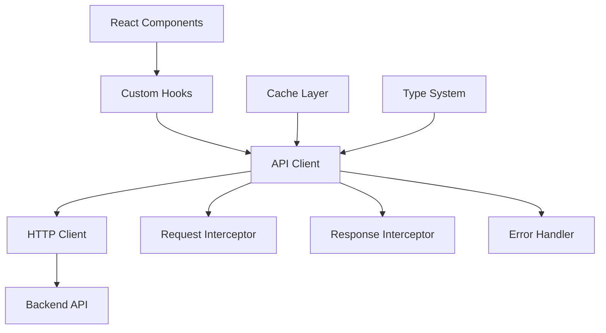

# 第4章：API 客户端与数据管理

## 🎯 本章目标

学习如何构建健壮的 API 客户端：
- HTTP 客户端封装
- 请求和响应拦截器
- 错误处理机制
- 缓存策略实现

## 🏗 API 客户端架构

### 架构设计



### 核心组件

1. **HTTP 客户端**：基于 Axios 的请求封装
2. **拦截器系统**：请求/响应的统一处理
3. **错误处理**：统一的错误处理和重试机制
4. **类型安全**：完整的 TypeScript 支持
5. **缓存层**：智能的数据缓存策略

## 🔧 HTTP 客户端实现

### 基础客户端配置

创建 `src/lib/api.ts`：

```typescript
import axios, { AxiosInstance, AxiosError, AxiosRequestConfig } from 'axios';
import {
  ShortenRequest,
  ShortenResponse,
  URLInfoResponse,
  HealthResponse,
  StatsResponse,
  ErrorResponse,
  ApiResponse,
} from '@/types/api';

// API 客户端配置
const API_BASE_URL = process.env.NEXT_PUBLIC_API_BASE_URL || 'http://localhost:8080';
const DEFAULT_TIMEOUT = 10000;

// 自定义错误类
export class APIError extends Error {
  constructor(
    message: string,
    public status: number,
    public code?: string,
    public details?: any
  ) {
    super(message);
    this.name = 'APIError';
  }
}

// 请求配置接口
interface RequestConfig extends AxiosRequestConfig {
  skipErrorHandler?: boolean;
  retryCount?: number;
  cacheKey?: string;
  cacheTTL?: number;
}

// API 客户端类
class APIClient {
  private client: AxiosInstance;
  private cache: Map<string, { data: any; expiry: number }> = new Map();

  constructor() {
    this.client = axios.create({
      baseURL: API_BASE_URL,
      timeout: DEFAULT_TIMEOUT,
      headers: {
        'Content-Type': 'application/json',
        'Accept': 'application/json',
      },
    });

    this.setupInterceptors();
  }

  // 设置拦截器
  private setupInterceptors() {
    // 请求拦截器
    this.client.interceptors.request.use(
      (config) => {
        // 添加请求时间戳
        config.metadata = { 
          startTime: new Date(),
          requestId: this.generateRequestId()
        };

        // 添加认证头（如果需要）
        const token = this.getAuthToken();
        if (token) {
          config.headers.Authorization = `Bearer ${token}`;
        }

        // 日志记录
        this.logRequest(config);

        return config;
      },
      (error) => {
        console.error('Request interceptor error:', error);
        return Promise.reject(error);
      }
    );

    // 响应拦截器
    this.client.interceptors.response.use(
      (response) => {
        // 计算请求耗时
        const endTime = new Date();
        const duration = endTime.getTime() - response.config.metadata?.startTime?.getTime();
        
        // 日志记录
        this.logResponse(response, duration);

        // 缓存响应（如果配置了缓存）
        this.cacheResponse(response);

        return response;
      },
      (error: AxiosError) => {
        // 统一错误处理
        return Promise.reject(this.handleError(error));
      }
    );
  }

  // 生成请求 ID
  private generateRequestId(): string {
    return `req_${Date.now()}_${Math.random().toString(36).substr(2, 9)}`;
  }

  // 获取认证令牌
  private getAuthToken(): string | null {
    // 从 localStorage 或其他地方获取令牌
    if (typeof window !== 'undefined') {
      return localStorage.getItem('auth_token');
    }
    return null;
  }

  // 请求日志
  private logRequest(config: any) {
    if (process.env.NODE_ENV === 'development') {
      console.log(`🚀 API Request: ${config.method?.toUpperCase()} ${config.url}`, {
        requestId: config.metadata?.requestId,
        data: config.data,
        params: config.params,
      });
    }
  }

  // 响应日志
  private logResponse(response: any, duration: number) {
    if (process.env.NODE_ENV === 'development') {
      console.log(`✅ API Response: ${response.config.method?.toUpperCase()} ${response.config.url} - ${duration}ms`, {
        requestId: response.config.metadata?.requestId,
        status: response.status,
        data: response.data,
      });
    }
  }

  // 错误处理
  private handleError(error: AxiosError): APIError {
    // 网络错误
    if (!error.response) {
      return new APIError(
        'Network error - please check your connection',
        0,
        'NETWORK_ERROR',
        { originalError: error.message }
      );
    }

    // HTTP 错误
    const { status, data } = error.response;
    const errorData = data as ErrorResponse;

    // 根据状态码处理不同类型的错误
    switch (status) {
      case 400:
        return new APIError(
          errorData.message || 'Bad request',
          status,
          errorData.error || 'BAD_REQUEST',
          errorData.details
        );
      case 401:
        this.handleUnauthorized();
        return new APIError(
          'Unauthorized - please login again',
          status,
          'UNAUTHORIZED'
        );
      case 403:
        return new APIError(
          'Forbidden - insufficient permissions',
          status,
          'FORBIDDEN'
        );
      case 404:
        return new APIError(
          errorData.message || 'Resource not found',
          status,
          errorData.error || 'NOT_FOUND'
        );
      case 429:
        return new APIError(
          'Too many requests - please try again later',
          status,
          'RATE_LIMITED'
        );
      case 500:
        return new APIError(
          'Internal server error - please try again later',
          status,
          'INTERNAL_ERROR'
        );
      default:
        return new APIError(
          errorData.message || 'An unexpected error occurred',
          status,
          errorData.error || 'UNKNOWN_ERROR',
          errorData.details
        );
    }
  }

  // 处理未授权错误
  private handleUnauthorized() {
    // 清除认证信息
    if (typeof window !== 'undefined') {
      localStorage.removeItem('auth_token');
      // 可以触发重定向到登录页面
      // window.location.href = '/login';
    }
  }

  // 缓存响应
  private cacheResponse(response: any) {
    const config = response.config as RequestConfig;
    if (config.cacheKey && config.cacheTTL) {
      const expiry = Date.now() + config.cacheTTL;
      this.cache.set(config.cacheKey, {
        data: response.data,
        expiry
      });
    }
  }

  // 获取缓存
  private getCache(key: string): any | null {
    const cached = this.cache.get(key);
    if (cached && cached.expiry > Date.now()) {
      return cached.data;
    }
    if (cached) {
      this.cache.delete(key);
    }
    return null;
  }

  // 通用请求方法
  private async request<T>(config: RequestConfig): Promise<T> {
    // 检查缓存
    if (config.cacheKey) {
      const cached = this.getCache(config.cacheKey);
      if (cached) {
        return cached;
      }
    }

    try {
      const response = await this.client.request<T>(config);
      return response.data;
    } catch (error) {
      // 重试逻辑
      if (config.retryCount && config.retryCount > 0) {
        console.log(`Retrying request... (${config.retryCount} attempts left)`);
        await this.delay(1000); // 等待 1 秒后重试
        return this.request<T>({
          ...config,
          retryCount: config.retryCount - 1
        });
      }
      throw error;
    }
  }

  // 延迟函数
  private delay(ms: number): Promise<void> {
    return new Promise(resolve => setTimeout(resolve, ms));
  }
```

### API 方法实现

```typescript
  // ===== URL 短链接相关 API =====

  // 创建短链接
  async shortenURL(request: ShortenRequest): Promise<ShortenResponse> {
    return this.request<ShortenResponse>({
      method: 'POST',
      url: '/shorten',
      data: request,
      retryCount: 2,
    });
  }

  // 获取短链接信息
  async getURLInfo(shortCode: string): Promise<URLInfoResponse> {
    return this.request<URLInfoResponse>({
      method: 'GET',
      url: `/info/${shortCode}`,
      cacheKey: `url_info_${shortCode}`,
      cacheTTL: 5 * 60 * 1000, // 5 分钟缓存
      retryCount: 3,
    });
  }

  // 批量获取 URL 信息
  async getURLList(shortCodes: string[]): Promise<URLInfoResponse[]> {
    const promises = shortCodes.map(code => 
      this.getURLInfo(code).catch(error => {
        console.warn(`Failed to fetch URL info for ${code}:`, error);
        return null;
      })
    );

    const results = await Promise.allSettled(promises);
    return results
      .filter((result): result is PromiseFulfilledResult<URLInfoResponse> => 
        result.status === 'fulfilled' && result.value !== null
      )
      .map(result => result.value);
  }

  // 删除短链接（如果后端支持）
  async deleteURL(shortCode: string): Promise<void> {
    return this.request<void>({
      method: 'DELETE',
      url: `/urls/${shortCode}`,
      retryCount: 1,
    });
  }

  // ===== 统计相关 API =====

  // 获取统计信息
  async getStats(): Promise<StatsResponse> {
    return this.request<StatsResponse>({
      method: 'GET',
      url: '/stats',
      cacheKey: 'stats',
      cacheTTL: 2 * 60 * 1000, // 2 分钟缓存
      retryCount: 2,
    });
  }

  // 健康检查
  async healthCheck(): Promise<HealthResponse> {
    return this.request<HealthResponse>({
      method: 'GET',
      url: '/health',
      timeout: 5000, // 5 秒超时
      retryCount: 1,
    });
  }

  // ===== 工具方法 =====

  // URL 验证
  validateURL(url: string): { isValid: boolean; error?: string } {
    if (!url || url.trim().length === 0) {
      return { isValid: false, error: 'URL is required' };
    }

    // 基础格式检查
    const urlPattern = /^(https?:\/\/)?([\da-z\.-]+)\.([a-z\.]{2,6})([\/\w \.-]*)*\/?$/;
    if (!urlPattern.test(url)) {
      return { isValid: false, error: 'Invalid URL format' };
    }

    // 长度检查
    if (url.length > 2048) {
      return { isValid: false, error: 'URL is too long (max 2048 characters)' };
    }

    // 协议检查
    try {
      const urlObj = new URL(url.startsWith('http') ? url : `http://${url}`);
      if (!['http:', 'https:'].includes(urlObj.protocol)) {
        return { isValid: false, error: 'Only HTTP and HTTPS URLs are supported' };
      }
    } catch {
      return { isValid: false, error: 'Invalid URL format' };
    }

    return { isValid: true };
  }

  // 清除缓存
  clearCache(pattern?: string) {
    if (pattern) {
      const regex = new RegExp(pattern);
      for (const key of this.cache.keys()) {
        if (regex.test(key)) {
          this.cache.delete(key);
        }
      }
    } else {
      this.cache.clear();
    }
  }

  // 获取缓存统计
  getCacheStats() {
    const now = Date.now();
    let validEntries = 0;
    let expiredEntries = 0;

    for (const [key, value] of this.cache.entries()) {
      if (value.expiry > now) {
        validEntries++;
      } else {
        expiredEntries++;
      }
    }

    return {
      total: this.cache.size,
      valid: validEntries,
      expired: expiredEntries,
    };
  }
}

// 导出单例实例
export const apiClient = new APIClient();

// 导出便捷方法
export const {
  shortenURL,
  getURLInfo,
  getURLList,
  deleteURL,
  getStats,
  healthCheck,
  validateURL,
  clearCache,
  getCacheStats,
} = apiClient;
```

## 🔄 请求重试机制

### 智能重试策略

```typescript
// 重试配置
interface RetryConfig {
  maxRetries: number;
  baseDelay: number;
  maxDelay: number;
  backoffFactor: number;
  retryCondition?: (error: APIError) => boolean;
}

// 默认重试配置
const DEFAULT_RETRY_CONFIG: RetryConfig = {
  maxRetries: 3,
  baseDelay: 1000,
  maxDelay: 10000,
  backoffFactor: 2,
  retryCondition: (error) => {
    // 只重试网络错误和 5xx 服务器错误
    return error.status === 0 || (error.status >= 500 && error.status < 600);
  },
};

// 重试装饰器
function withRetry<T extends any[], R>(
  fn: (...args: T) => Promise<R>,
  config: Partial<RetryConfig> = {}
) {
  const retryConfig = { ...DEFAULT_RETRY_CONFIG, ...config };

  return async (...args: T): Promise<R> => {
    let lastError: APIError;
    
    for (let attempt = 0; attempt <= retryConfig.maxRetries; attempt++) {
      try {
        return await fn(...args);
      } catch (error) {
        lastError = error as APIError;
        
        // 检查是否应该重试
        if (
          attempt === retryConfig.maxRetries ||
          !retryConfig.retryCondition?.(lastError)
        ) {
          throw lastError;
        }

        // 计算延迟时间（指数退避）
        const delay = Math.min(
          retryConfig.baseDelay * Math.pow(retryConfig.backoffFactor, attempt),
          retryConfig.maxDelay
        );

        console.log(`Retrying in ${delay}ms... (attempt ${attempt + 1}/${retryConfig.maxRetries})`);
        await new Promise(resolve => setTimeout(resolve, delay));
      }
    }

    throw lastError!;
  };
}

// 使用重试装饰器
export const shortenURLWithRetry = withRetry(apiClient.shortenURL.bind(apiClient), {
  maxRetries: 2,
  retryCondition: (error) => error.status >= 500,
});
```

## 📦 缓存策略实现

### 多级缓存系统

```typescript
// 缓存接口
interface CacheInterface {
  get<T>(key: string): T | null;
  set<T>(key: string, value: T, ttl?: number): void;
  delete(key: string): void;
  clear(): void;
  has(key: string): boolean;
}

// 内存缓存实现
class MemoryCache implements CacheInterface {
  private cache = new Map<string, { data: any; expiry: number }>();

  get<T>(key: string): T | null {
    const item = this.cache.get(key);
    if (!item) return null;

    if (item.expiry < Date.now()) {
      this.cache.delete(key);
      return null;
    }

    return item.data;
  }

  set<T>(key: string, value: T, ttl = 5 * 60 * 1000): void {
    this.cache.set(key, {
      data: value,
      expiry: Date.now() + ttl,
    });
  }

  delete(key: string): void {
    this.cache.delete(key);
  }

  clear(): void {
    this.cache.clear();
  }

  has(key: string): boolean {
    const item = this.cache.get(key);
    if (!item) return false;
    
    if (item.expiry < Date.now()) {
      this.cache.delete(key);
      return false;
    }
    
    return true;
  }
}

// localStorage 缓存实现
class LocalStorageCache implements CacheInterface {
  private prefix = 'api_cache_';

  get<T>(key: string): T | null {
    if (typeof window === 'undefined') return null;

    try {
      const item = localStorage.getItem(this.prefix + key);
      if (!item) return null;

      const parsed = JSON.parse(item);
      if (parsed.expiry < Date.now()) {
        localStorage.removeItem(this.prefix + key);
        return null;
      }

      return parsed.data;
    } catch {
      return null;
    }
  }

  set<T>(key: string, value: T, ttl = 5 * 60 * 1000): void {
    if (typeof window === 'undefined') return;

    try {
      const item = {
        data: value,
        expiry: Date.now() + ttl,
      };
      localStorage.setItem(this.prefix + key, JSON.stringify(item));
    } catch (error) {
      console.warn('Failed to cache to localStorage:', error);
    }
  }

  delete(key: string): void {
    if (typeof window === 'undefined') return;
    localStorage.removeItem(this.prefix + key);
  }

  clear(): void {
    if (typeof window === 'undefined') return;
    
    const keys = Object.keys(localStorage);
    keys.forEach(key => {
      if (key.startsWith(this.prefix)) {
        localStorage.removeItem(key);
      }
    });
  }

  has(key: string): boolean {
    return this.get(key) !== null;
  }
}

// 缓存管理器
class CacheManager {
  private memoryCache = new MemoryCache();
  private persistentCache = new LocalStorageCache();

  // 获取缓存（先查内存，再查持久化）
  get<T>(key: string): T | null {
    let value = this.memoryCache.get<T>(key);
    if (value !== null) return value;

    value = this.persistentCache.get<T>(key);
    if (value !== null) {
      // 回填到内存缓存
      this.memoryCache.set(key, value, 5 * 60 * 1000);
    }

    return value;
  }

  // 设置缓存（同时设置内存和持久化）
  set<T>(key: string, value: T, ttl = 5 * 60 * 1000): void {
    this.memoryCache.set(key, value, ttl);
    this.persistentCache.set(key, value, ttl);
  }

  // 删除缓存
  delete(key: string): void {
    this.memoryCache.delete(key);
    this.persistentCache.delete(key);
  }

  // 清空缓存
  clear(): void {
    this.memoryCache.clear();
    this.persistentCache.clear();
  }

  // 检查缓存是否存在
  has(key: string): boolean {
    return this.memoryCache.has(key) || this.persistentCache.has(key);
  }
}

export const cacheManager = new CacheManager();
```

## 🔍 请求监控和调试

### 请求监控系统

```typescript
// 请求监控接口
interface RequestMetrics {
  url: string;
  method: string;
  duration: number;
  status: number;
  success: boolean;
  timestamp: number;
  requestId: string;
}

// 监控管理器
class RequestMonitor {
  private metrics: RequestMetrics[] = [];
  private maxMetrics = 100;

  // 记录请求指标
  recordRequest(metrics: RequestMetrics): void {
    this.metrics.push(metrics);
    
    // 保持最大数量限制
    if (this.metrics.length > this.maxMetrics) {
      this.metrics.shift();
    }

    // 在开发环境下输出详细信息
    if (process.env.NODE_ENV === 'development') {
      this.logMetrics(metrics);
    }
  }

  // 输出指标日志
  private logMetrics(metrics: RequestMetrics): void {
    const { url, method, duration, status, success } = metrics;
    const emoji = success ? '✅' : '❌';
    const color = success ? 'color: green' : 'color: red';
    
    console.log(
      `%c${emoji} ${method} ${url} - ${duration}ms (${status})`,
      color,
      { requestId: metrics.requestId }
    );
  }

  // 获取统计信息
  getStats() {
    const total = this.metrics.length;
    const successful = this.metrics.filter(m => m.success).length;
    const failed = total - successful;
    const avgDuration = total > 0 
      ? this.metrics.reduce((sum, m) => sum + m.duration, 0) / total 
      : 0;

    return {
      total,
      successful,
      failed,
      successRate: total > 0 ? (successful / total) * 100 : 0,
      avgDuration: Math.round(avgDuration),
      recentRequests: this.metrics.slice(-10),
    };
  }

  // 清除指标
  clear(): void {
    this.metrics = [];
  }
}

export const requestMonitor = new RequestMonitor();
```

## 📝 小结

本章我们实现了完整的 API 客户端系统：

1. **HTTP 客户端**：基于 Axios 的封装，支持拦截器和配置
2. **错误处理**：统一的错误类型和处理机制
3. **重试机制**：智能的请求重试和退避策略
4. **缓存系统**：多级缓存提升性能
5. **监控调试**：请求监控和性能分析

关键要点：
- 拦截器提供统一的请求/响应处理
- 类型安全确保 API 调用的正确性
- 缓存策略减少不必要的网络请求
- 错误处理提供良好的用户体验
- 监控系统帮助调试和性能优化

下一章我们将学习自定义 Hooks 的开发。
